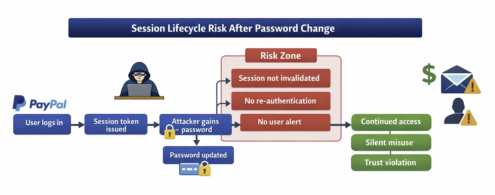

# Session Lifecycle Risk After Credential Change

## Session Lifecycle Flow

The following diagram illustrates how user expectations diverge from system
behavior, creating a risk window after a password change.

## Summary

In account-based systems, users reasonably expect that a password change
immediately revokes all existing access to their account.  
This case study examines a failure scenario where that expectation is not met,
creating a risk of silent account misuse despite a user-initiated security action.

The focus is not on exploitation, but on **risk, user trust, and system behavior
under real-world conditions**.

---

## User Expectation

When a user changes their password—especially after suspicious activity—they
expect the system to:

- Invalidate all existing sessions
- Require re-authentication for future access
- Restore account security immediately

This expectation is foundational to user trust in security controls.

---

## Observed System Behavior

In this scenario, a password change successfully updates account credentials,
but **previously established authenticated sessions remain valid**.

The system does not enforce session revocation or re-authentication for
already active sessions.

---

## Failure Scenario

If an attacker had access to the account prior to the password change
(e.g., through credential compromise, shared devices, or malware),
they could continue interacting with the account without interruption.

No additional authentication challenge is triggered, and the user receives
no indication that access remains active elsewhere.

---

## Abuse Potential

This behavior enables **silent account misuse**, characterized by:

- Continued access after a perceived security reset
- Low likelihood of immediate detection
- Abuse that blends into normal user activity

The issue does not rely on exploiting a vulnerability, but on **leveraging
expected system behavior in an unintended way**.

---

## Business and User Impact

For platforms handling sensitive data or financial actions, this creates risk in
multiple dimensions:

- **Account Integrity:** Unauthorized actions may continue after a security reset  
- **User Trust:** Security controls provide false reassurance  
- **Fraud Risk:** Misuse may occur without triggering alerts  
- **Operational Cost:** Delayed detection increases investigation complexity  

Security actions that fail to reduce risk immediately can increase overall harm.

---

## Detection and Visibility Gap

Although password change events may be logged, the system lacks explicit
visibility into:

- Continued session validity post-credential change
- Correlation between password resets and subsequent account activity
- Indicators of session reuse after a security-sensitive action

This limits both real-time detection and post-incident analysis.

---

## Risk-Driven Mitigation Strategies

Effective mitigations include:

- Invalidating all active sessions upon password change
- Rotating session identifiers and enforcing re-authentication
- Applying stricter authentication requirements for sensitive actions
- Monitoring account activity following credential updates

These controls align system behavior with user security expectations.

---

## Security Insight

Authentication security is not defined solely by credential strength.
It depends equally on **session lifecycle management and system state
transitions following security-critical actions**.

In high-trust systems, security controls must translate directly into
immediate risk reduction.

---

## Why This Case Matters

This scenario illustrates how subtle mismatches between user expectation
and system behavior can create disproportionate risk—without triggering
traditional vulnerability indicators.

Understanding and addressing these gaps is essential for security teams operating at scale in high-trust systems.

